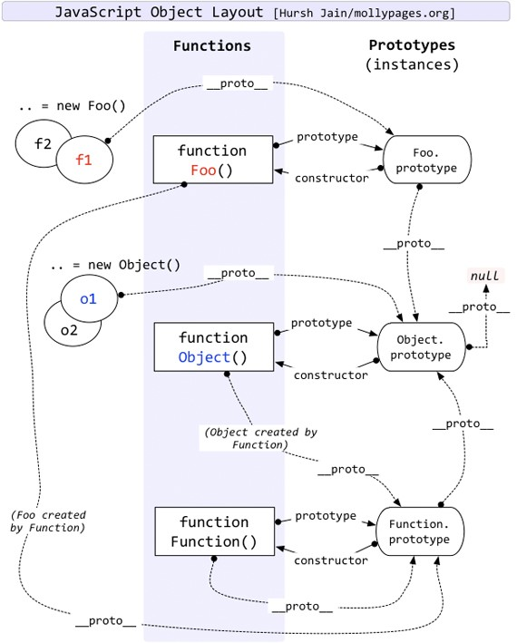

# Understand JS Prototype

* Author: Larry
* Date: 10/20/2018

## Object

JavaScript 中，对象是7种原始类型(simple primitive type)的一种。

```JS
    typeof ''; // string
    typeof 0; // number
    typeof true; // boolean
    typeof undefined; // undefined
    typeof null; // object; This is a language bug when JS was created.
    typeof {}; // object
    typeof Symbol(); // symbol; ES6+
```

注：funtions 是object的一个子类型 (technically, a "callable object")。

```JS
    typeof function(){}; // function
```

Object可以分为普通对象和函数对象。

凡是通过 new Function() 创建的对象都是函数对象(构造器)，其他的都是普通对象。

```JS
    //  普通对象
    let o1 = {};
    let o2 = new Object();
    let o3 = new f1();
    typeof o1; // object

    // 函数对象
    function F1(){};
    let F2 = function(){};
    let F3 = new Function('str', 'console.log(str)');
    typeof F1; // function
```

## Constructor

所有的构造器都来自于Function.prototype，甚至包括根构造器Object及Function自身。

Number, Boolean, String, Object, Function, Array, RegExp, Error, Date, Symbol.

注: Math, JSON 是普通对象，不能new。

```JS
    Object.constructor === Function; // true
    Function.constructor === Function; //true
    typeof Object; // function
    typeof Boolean; // function
```

```JS
    function F1() {};
    let f1 = new F1();

    f1.constructor === F1; // true
    f1 instanceof F1; // true
```

## prototype and `__proto__`

除了null, undefined外，每个对象都有 `__proto__` 属性，但只有函数对象才有 prototype 属性。

**所有普通对象的 `__proto__` 都指向其构造器的 prototype**

**所有函数对象的 `__proto__` 都指向其Function.prototype**

`__proto__` 以后不推荐使用，用Objet.getPrototypeOf()。

```JS
    function F1() {};
    let f1 = new F1();

    f1.__proto__ === F1.prototype; // true
    f1.prototype === undefined; // true
    F1.prototype.__proto__ === Object.prototype; //true

    Number.__proto__ === Function.prototype; // true
    Array.__proto__ === Function.prototype; // true
    Function.__proto__ === Function.prototype; // true!!! <Speical>. Function is created by itself.
```

对于实例对象来说，它本身没有constructor属性的。

```JS
    function F1() {};
    F1.prototype = {}; // create a new prototype object

    let f1 = new F1();
    f1.constructor === F1; // false
    f1.constructor === Object; //true
```

## 原型对象(XXX.prototype)

原型对象是一个普通对象， 可以**看作是**构造函数XXX的一个实例。

```JS
    function Person(){};
    Person.prototype.constructor === Person; // true
    typeof Person.prototype // object

    Person.prototype = {
        name: 'A',
        age: 0
    };
    p = new Person();
    p.age === 0; // true
    p.hasOwnProperty('age'); // fasle
```

let f1 = new F1() 等同于：

```JS
    let f1 = new Object(); // same with: let f1 = {};
    f1.__proto__ = F1.prototype;
    F1.call(ff);
```

Function.prototype是唯一例外, 它是一个空函数。

ƒ () { [native code] }

```JS
    typeof Date.prototype; // object
    typeof Error.prototype; // object
    typeof Function.prototype; // function!
    console.log(Function.prototype); // undefined
```

## 原型链




原型链的形成是真正是靠__proto__ 而非prototype。

```JS
    function Animal(){};
    function Dog(){};

    Animal.weight = 200;
    Dog.prototype = Animal;
    let tidy = new Dog();
    console.log(Dog.weight); // ???
    console.log(tidy.weight); // ???
```

## 原型继承

1. 定义新的构造函数，并在内部用call()调用希望“继承”的构造函数，并绑定this；

2. 改变原型链实现继承。

```JS
    function Animal(props) {
        this.name = props.name || 'Unnamed';
    }

    Animal.prototype.hello = function () {
        console.log('Hello, ' + this.name + '!');
    }

    function Cat(props) {
        // 调用Animal构造函数，绑定this变量:
        Animal.call(this, props);
        this.age = props.age || 1;
    }
```

```JS
    new Cat() ----> Cat.prototype ----> Object.prototype ----> null

    // 改变原型链实现正确继承:
    new Cat() ----> Cat.prototype ----> Animal.prototype ----> Object.prototype ----> null

```

```JS
    //pre-ES6
    Cat.prototype = Object.create(Animal.prototype);
    Object.create = function(obj) {
        function F(){} // 桥接函数
        F.prototype = obj;
        return new F();
    }

    // ES6+
    Cat.prototype.__proto__ = Animal.prototype; // not-recommended

    Object.setPrototypeOf(Cat.prototype, Animal.prototype);
```

Inspecting "Inheritance" Relationships

```JS
    let tom = new Cat({name: 'Tom'});
    tom.hello();
    tom instanceof Cat;
    tom instanceof Animal;
    tom.__proto__.__proto__;
```